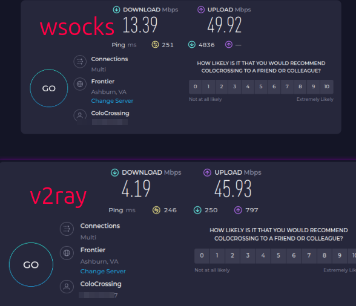

# SOCKS5-WebSocket 代理

基于 WebSocket 的 SOCKS5 代理工具，用于网络穿透和流量转发。

## 原理

```
本地应用 <--SOCKS5--> 客户端 <--WebSocket--> 服务端 <--TCP--> 目标服务器
```

- **客户端**：在本地启动 SOCKS5 服务器，将流量通过 WebSocket 转发到远程服务端
- **服务端**：接收 WebSocket 连接，代理访问目标服务器
- 使用 WebSocket 连接池, 提升并发性能
- 通过密码和消息签名保证连接安全


## 安装

```bash
pip install wsocks
```


## 使用方法

### 1. 服务端配置

编辑 `config_server.json`：

```json
{
  "server": {
    "host": "0.0.0.0",
    "port": 8888,
    "path": "/ws",
    "password": "your-password-here"
  },
  "log_level": "INFO"
}
```

### 2. 启动服务端

在有公网 IP 的服务器上运行：

```bash
wsocks_server -c config_server.json
```

### 3. 客户端配置

编辑 `config_client.json`：

```json
{
  "server": {
    "url": "ws://your-server.com:8888/ws",
    "password": "your-password-here",
    "compression": true,
    "ws_pool_size": 8,
    "heartbeat_enabled": true,
    "heartbeat_min": 20,
    "heartbeat_max": 50
  },
  "local": {
    "host": "127.0.0.1",
    "port": 1080
  },
  "log_level": "INFO"
}
```

推荐自行配置使用wss

### 4. 启动客户端

```bash
wsocks_client -c config_client.json
```

### 5. 配置代理

在浏览器或应用中设置 SOCKS5 代理：
- 服务器：`127.0.0.1`
- 端口：`1080`

## 配置参数说明

### 服务端参数

| 参数 | 说明 | 默认值 |
|------|------|--------|
| host | 监听地址 | 0.0.0.0 |
| port | 监听端口 | 8888 |
| password | 连接密码 | - |
| timeout | 连接超时（秒） | 30 |
| max_connections | 最大并发连接数 | 1000 |

### 客户端参数

| 参数 | 说明 | 默认值 |
|------|------|--------|
| server.url | 服务端地址 | - |
| server.password | 连接密码 | - |
| server.compression | 启用数据压缩 | true |
| server.ws_pool_size | WebSocket 连接池大小 | 8 |
| server.heartbeat_enabled | 启用应用层随机心跳 | true |
| server.heartbeat_min | 心跳最小间隔（秒） | 20 |
| server.heartbeat_max | 心跳最大间隔（秒） | 50 |
| local.port | 本地 SOCKS5 端口 | 1080 |


## 对比
同一服务器与v2ray对比


## 常见问题

**无法连接服务端**
- 检查服务端是否运行
- 确认防火墙端口已开放
- 验证密码是否一致

**上传速度慢**
- 增加 `ws_pool_size`（建议 8-32）

**连接频繁断开**
- 调整 `ping_interval` 和 `ping_timeout`
- 增加服务端 `timeout` 值
- 

## 安全建议

- 修改默认密码，使用强密码
- 生产环境使用 WSS（WebSocket over TLS）
- 配置防火墙限制访问 IP

## 许可证

MIT License

## 注意事项

本工具仅供学习和合法用途使用，请遵守当地法律法规。
